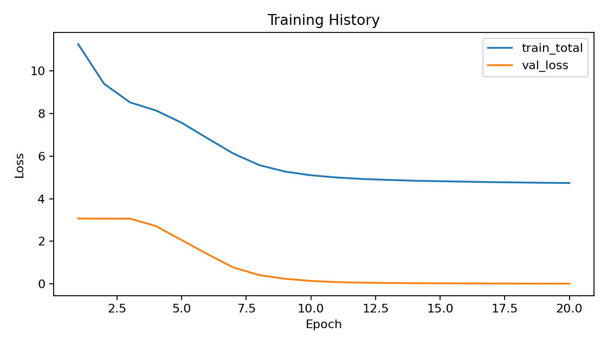

# Compressed-Sensing-LLM

This repository is a PyTorch research prototype for a **adaptive-sparse-language-model**.

The project explores how ideas from **compressed sensing**, **sparse support recovery**, and **adaptive measurement allocation** can be used to control the execution of a small causal language model. Instead of activating the same full model structure for every token and every task, the model learns a sparse, task-conditioned support over structured model components such as attention heads and feed-forward blocks.

This is not a production LLM runtime. It is a compact research prototype designed to test the main architectural idea in a controlled, CPU-friendly setting.

## Project Motivation

Large language models usually perform inference using a fixed computation graph. Every input activates the same layers, heads, and feed-forward modules, even when some inputs may only require a smaller subset of the model.

This project studies a different idea:

> Can we use compressed-sensing-style measurements to recover a sparse computational support for each task and token?

The goal is to make the model dynamically choose which structured components should be active, based on the task, prompt, and uncertainty of the current token representation.

## Compressed Sensing View

In classical compressed sensing, a sparse signal can be recovered from a smaller number of measurements:

$$
y = \Phi x,
$$

where:

- $x$ is the unknown sparse signal,
- $\Phi$ is the measurement matrix,
- $y$ is the compressed measurement vector.

If $x$ is sparse, then it may be possible to recover it even when the number of measurements is much smaller than the dimension of $x$.

In this project, the sparse object is not a classical signal. Instead, the sparse object is a **support vector over model components**.

The model tries to recover which components should be active:

$$
\text{context representation}
\rightarrow
\text{compressed measurements}
\rightarrow
\text{sparse support}
\rightarrow
\text{dynamic model execution}.
$$

The recovered support controls structured parts of the language model, such as attention heads and feed-forward blocks.

## LLM View

The model is a small causal sequence model. It receives tokenized prompts and predicts output tokens for simple symbolic tasks.

The input format is task-conditioned. For example, a sequence may contain:

```text
<bos> <task_reverse> <sep> 3 1 7 <out> 7 1 3 <eos>
```

The model must learn both:

1. the language modeling task, meaning it must predict the correct output tokens;
2. the dynamic execution policy, meaning it must activate task-relevant model components.

The model is trained with a combination of language-model loss and auxiliary losses that encourage useful prompt compression, support recovery, temporal smoothness, and efficient measurement usage.

## Repository Structure

```text
Compressed-Sensing-LLM/
│
├── configs/
│   └── default.yaml
│
├── data/
│   └── benchmark/
│       ├── STATS.json
│       ├── train.jsonl
│       ├── val.jsonl
│       └── test.jsonl
│
├── outputs/
│   ├── METRICS_SUMMARY.md
│   ├── checkpoint.pt
│   ├── loss_curve.png
│   ├── metrics.json
│   └── train_history.csv
│
├── scripts/
│   ├── eval_checkpoint.py
│   ├── generate_benchmark.py
│   └── train_benchmark.py
│
├── src/
│   └── csllm/
│       ├── __init__.py
│       ├── data.py
│       ├── metrics.py
│       ├── model.py
│       └── train.py
│
├── requirements.txt
└── README.md
```

## Main Files

| File | Description |
|---|---|
| `configs/default.yaml` | Default model, training, and data configuration. |
| `scripts/generate_benchmark.py` | Generates the synthetic benchmark splits. |
| `scripts/train_benchmark.py` | Trains the model and saves training outputs. |
| `scripts/eval_checkpoint.py` | Evaluates a saved checkpoint. |
| `src/csllm/data.py` | Defines tasks, vocabulary, oracle supports, dataset loading, and batch collation. |
| `src/csllm/model.py` | Implements the dynamic sparse language model, prompt compressor, support controller, sparse attention, and sparse feed-forward blocks. |
| `src/csllm/train.py` | Implements training, validation, loss computation, checkpointing, and plotting. |
| `src/csllm/metrics.py` | Computes token accuracy, sequence exact match, support precision/recall/F1, support drift, and active support fraction. |
| `outputs/loss_curve.png` | Saved training and validation loss curve. |
| `outputs/metrics.json` | Final train/validation/test metrics. |
| `outputs/checkpoint.pt` | Saved model checkpoint. |

## Synthetic Benchmark

The benchmark contains four prompt-conditioned sequence tasks.

| Task | Description | Example |
|---|---|---|
| `copy` | Copy the input digit sequence. | `3 1 7 → 3 1 7` |
| `reverse` | Reverse the digit sequence. | `3 1 7 → 7 1 3` |
| `sort` | Sort the digits in ascending order. | `3 1 7 → 1 3 7` |
| `parity` | Predict whether the digit sum is even or odd. | `3 1 7 → ODD` |

The dataset uses a small vocabulary consisting of:

- special tokens such as `<pad>`, `<bos>`, `<eos>`, `<sep>`, and `<out>`;
- task tokens such as `<task_copy>` and `<task_reverse>`;
- digit tokens from `0` to `9`;
- label tokens `EVEN` and `ODD`.

Each generated example also contains oracle support templates for the task. These oracle supports define which attention heads and feed-forward blocks are expected to be active for each task. This allows the project to evaluate not only prediction accuracy, but also whether the recovered sparse support matches the intended task structure.

## Model Architecture

The model is a compact causal Transformer-style network with dynamic structured sparsity.

It includes the following main components:

### 1. Token and Positional Embeddings

Each input token is mapped into a learned embedding space. Positional embeddings are added so the model can use token order.

### 2. Prompt Compressor

The prompt compressor predicts a keep probability for each token representation.

Special tokens and task tokens are always kept, while prompt-side digit tokens can be softly compressed. This allows the model to learn which parts of the prompt are important for solving the current task.

Conceptually:

$$
h_t' = q_t h_t,
$$

where $h_t$ is the token representation and $q_t$ is the learned prompt keep probability.

### 3. Task-Conditioned Support Controller

The support controller is the compressed-sensing-inspired part of the model.

For each token representation, the controller combines the token state with a task embedding:

$$
u_t = h_t + e_{\text{task}}.
$$

Then it applies a task-conditioned measurement bank:

$$
z_t = \Phi_{\text{task}} u_t.
$$

Here, $z_t$ is a compressed sketch of the token/task state. The sketch is then decoded into scores over attention heads and feed-forward blocks.

### 4. Uncertainty-Driven Adaptive Sensing

The controller estimates uncertainty using a lightweight prediction head. Higher entropy means the model is less confident.

The measurement budget is adjusted using this uncertainty:

$$
m_t =
\mathrm{clip}
\left(
\left\lfloor
m_{\text{base}}(1 + \gamma H_t)
\right\rfloor,
m_{\min},
m_{\max}
\right),
$$

where:

- $H_t$ is normalized entropy,
- $m_{\text{base}}$ is the base number of measurements,
- $m_{\min}$ and $m_{\max}$ are the minimum and maximum budgets,
- $\gamma$ controls how strongly uncertainty increases the budget.

This means easier tokens can use fewer measurements, while harder or more uncertain tokens can use more measurements.

### 5. Sparse Attention Heads

The model uses structured masks over attention heads.

For each layer and token, the controller produces head scores. A straight-through top-k operation selects a fixed number of active heads.

This gives a hard sparse mask during the forward pass while still allowing gradient-based learning.

### 6. Sparse Feed-Forward Blocks

The feed-forward network is divided into multiple blocks. The controller also predicts which feed-forward blocks should be active.

Instead of applying one dense feed-forward module, the model computes several block outputs and combines only the selected ones.

### 7. Dynamic Transformer Layers

Each Transformer layer contains:

- sparse multi-head causal self-attention;
- sparse feed-forward blocks;
- residual connections;
- layer normalization.

The model therefore learns both token prediction and dynamic structured execution.

## Training Objective

The total training loss combines several terms:

$$
\mathcal{L}_{\text{total}} =
\mathcal{L}_{\text{LM}}+
\lambda_{\text{keep}}\mathcal{L}_{\text{keep}}+
\lambda_{\text{support}}\mathcal{L}_{\text{support}}+
\lambda_{\text{temporal}}\mathcal{L}_{\text{temporal}}+
\lambda_{\text{budget}}\mathcal{L}_{\text{budget}}.
$$

### Language Modeling Loss

The language modeling loss trains the model to predict the correct output tokens after `<out>`.

Prompt tokens are ignored in the target labels, so the model is evaluated only on the actual task output.

### Prompt Keep Loss

The prompt keep loss trains the prompt compressor against an oracle keep mask.

Special and task tokens are kept, while digit-token retention is learned.

### Support Recovery Loss

The support loss compares the predicted active attention heads and feed-forward blocks against the oracle task supports.

This encourages the model to learn task-specific sparse computational structure.

### Temporal Smoothness Loss

The temporal smoothness loss discourages support masks from changing too abruptly between adjacent tokens.

This is useful because stable supports are more realistic for structured dynamic execution.

### Budget Penalty

The budget penalty discourages the model from always using the maximum measurement budget.

This term encourages efficient adaptive sensing.

## Evaluation Metrics

The evaluation code reports both language-model metrics and compressed-sensing-style support metrics.

| Metric | Meaning |
|---|---|
| `loss` | Cross-entropy loss on target tokens. |
| `token_accuracy` | Fraction of correctly predicted target tokens. |
| `sequence_exact_match` | Fraction of examples where the entire output sequence is exactly correct. |
| `prompt_compression_ratio` | Average retained prompt mass relative to the oracle keep mask. |
| `measurement_budget_mean` | Average adaptive measurement budget used by the controller. |
| `support_precision` | Fraction of predicted active units that match the oracle support. |
| `support_recall` | Fraction of oracle support units selected by the model. |
| `support_f1` | Harmonic mean of support precision and recall. |
| `support_drift` | Average token-to-token change in support masks. |
| `active_support_fraction` | Average fraction of active attention heads and feed-forward blocks. |

These metrics are important because the project is not only about predicting the right output tokens. It also studies whether the model learns meaningful sparse supports and efficient dynamic execution.

## Current Result

The current available training result is the loss curve saved in:

```text
outputs/loss_curve.png
```

<p align="center">
  
</p>

**Figure 1.** Training history for the compressed-sensing-guided dynamic language model. The total training loss decreases steadily over 20 epochs, and the validation loss drops quickly toward zero.

## Interpretation of the Result

The loss curve shows that the full training pipeline works end to end.

The main observations are:

- The model successfully learns the synthetic benchmark tasks.
- The validation loss drops rapidly, which suggests the model generalizes well on the current synthetic validation split.
- The training objective decreases more slowly because it includes auxiliary losses beyond next-token prediction.
- The difference between `train_total` and `val_loss` is expected because `train_total` includes language modeling loss, prompt keep loss, support recovery loss, temporal smoothness, and budget penalty.
- The result confirms that the system can jointly train a causal sequence model and a compressed-sensing-inspired sparse execution controller.

## How to Run

Install dependencies:

```bash
pip install -r requirements.txt
```

Generate the benchmark:

```bash
python scripts/generate_benchmark.py
```

Train the model:

```bash
python scripts/train_benchmark.py --config configs/default.yaml
```

Evaluate a saved checkpoint:

```bash
python scripts/eval_checkpoint.py --config configs/default.yaml --checkpoint outputs/checkpoint.pt
```

## Expected Outputs

After training, the `outputs/` folder should contain:

```text
outputs/
├── METRICS_SUMMARY.md
├── checkpoint.pt
├── loss_curve.png
├── metrics.json
└── train_history.csv
```

## Requirements

The repository requires:

```text
torch>=2.0
pyyaml>=6.0
matplotlib>=3.7
pandas>=2.0
```

CPU-only execution is supported.

## Scope and Limitations

This repository is a research prototype.

It does not claim production-scale LLM acceleration. Instead, it tests the architectural idea of compressed-sensing-guided sparse dynamic execution in a small controlled model.

Current limitations include:

- synthetic benchmark only;
- small causal sequence model;
- no pretrained LLM integration;
- no real hardware benchmarking;
- no deployment-level inference optimization;
- current result is mainly a proof of concept for learning behavior.

## Key Takeaways

<div align="center">

<table>
  <tr>
    <th>Concept</th>
    <th>Main Takeaway</th>
  </tr>
  <tr>
    <td><b>Compressed sensing</b></td>
    <td>The project adapts sparse recovery ideas to dynamic model execution.</td>
  </tr>
  <tr>
    <td><b>Task-conditioned measurements</b></td>
    <td>The controller uses task information to produce sparse support decisions.</td>
  </tr>
  <tr>
    <td><b>Adaptive sensing</b></td>
    <td>The model changes its measurement budget based on uncertainty.</td>
  </tr>
  <tr>
    <td><b>Structured sparsity</b></td>
    <td>The support masks activate structured units such as attention heads and feed-forward blocks.</td>
  </tr>
  <tr>
    <td><b>LLM behavior</b></td>
    <td>The model learns symbolic sequence tasks through causal language modeling.</td>
  </tr>
  <tr>
    <td><b>Prototype result</b></td>
    <td>The loss curve shows that the system trains successfully on the synthetic benchmark.</td>
  </tr>
</table>

</div>

## Citation

This repository is based on the following manuscript:

```text
Compressed-Sensing-Guided, Inference-Aware Structured Reduction for Large Language Models
```

Reference:

```text
https://arxiv.org/abs/2604.14156
```

## License

MIT
